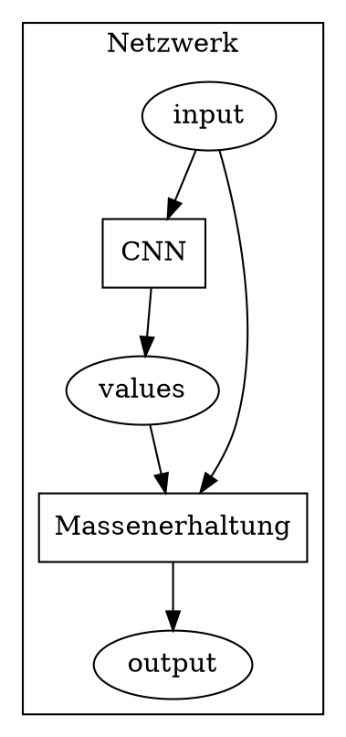

# Massenerhaltungs-Layer
Die Datei kann auch unter https://hackmd.io/bZNxZGo_Tvebw4yR3iPjOA angesehen werden.

## Topologie des Netzwerks

Sei nun $f$ die Funktion, die zu $input$ die Ausgabe $output$ des Netzwerks liefert.
Dann ist die Kostenfunktion des Netzwerks wie folgt:
$$
L(input, wanted\_output) = \frac{1}{n} \sum_{i=1}^{n} (f(input_i) - wanted\_output_i)^2
$$

Wenn uns die Testdaten als Sequenz $d$ vorliegen und die Indexmenge $J$ die $n$ daraus ausgewählten Beispiele beschreibt, gilt:
$$
\begin{align}
L(input, wanted\_output) &= L(d_J, d_{\{k+1|k \in J\}}) \\
&= \frac{1}{n} \sum_{i \in J} (f(d_i) - d_{i+1})^2
\end{align}
$$

Sei nun die Massenerhaltung durch die Funktion $g(input, values)$ repräsentiert und seien $input$, $values$ Vektoren der Länge $n$, dann gilt:
$$
\mu_{input} = \sum_{i=1}^{n} normalized\_volumes_i \cdot input_i \\
\mu_{values} = \sum_{i=1}^{n} normalized\_volumes_i \cdot values_i \\
g(input, values)_i = values \cdot (\mu_{input} / \mu_{values}) = output 
$$

Diese Umsetzung erreicht folgendes:
- Anpassung des Lernprozesses wie durch Veränderung der Kostenfunktion
- Benutzung des Netzwerkes ohne spätere Verarbeitungsschritte