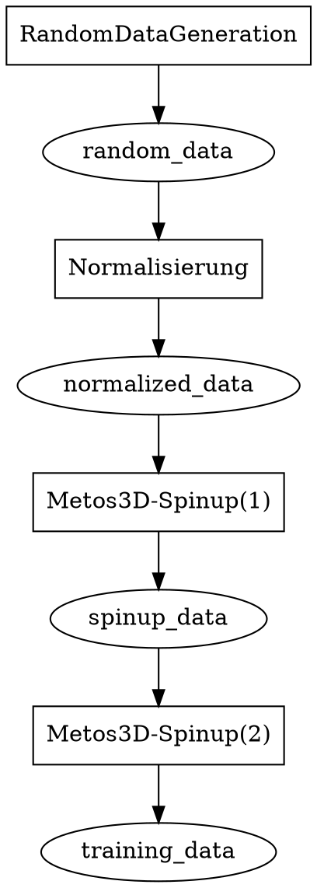
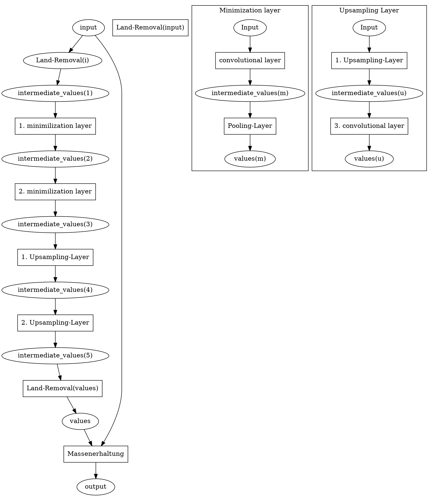
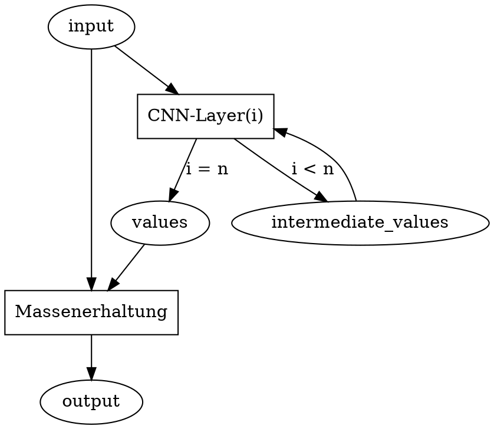

# Modell

## Aufgabe
Es soll Metos3D zur Simulation des reinen Transports abgelöst werden. Die Simulation eines Biomodells ist **nicht** Teil der Aufgabe.
Die Funktion $f$ stellt im Folgenden die Anwendung des Netzwerks zur Simulation des Transports dar. Die Funktion $g$ stellt die Anwendung eines Biomodells dar. Dann sieht die gewünschte Funktionsweise folgendermaßen aus:

$$
\tilde{x}_{k+1} = f(x_k) \\
x_{k+1} = g(\tilde{x}_{k+1})
$$

Mit dem kombinierten Modell (Netzwerk und Biomodell) soll auch der Spinup durchgeführt werden können.

## Trainingsdaten
Wir erzeugen die Trainingsdaten folgendermaßen:

Die Normalisierung sorgt für eine realistische Gesamtmasse der einzelnen Stoffe. Der erste Metos3D-Spinup sorgt für eine realistische Verteilung der Stoffe, da eine zufällige Verteilung viele sehr scharfe Kanten bietet, die in echt nicht auftreten.

## Visualisierung
 Zur Visualisierung benutzen wir Panoply. Wir erzeugen entsprechende NetCDF-Dateien mit den folgenden Daten:
  - original
  - diff
  - model_prediction

  Durch die Visualisierung durch Panoply kann dabei sehr gut der Output des Netzwerks nachvollzogen werden. 

## Probierte Modelle
- RNN
- CNN (3-D)
- CNN (1-D)

## CNN (3-D)
Folgende Features wurden erarbeitet und benutzt:
- LandRemoval
- MassConversation

### Topologien

## CNN (1-D)
Folgende Features wurden erarbeitet und benutzt:
- MassConversation

## Topologie
Die Struktur folgt der Struktur des CNN (3-D) bloß ohne Verwendung der Schicht LandRemoval.

